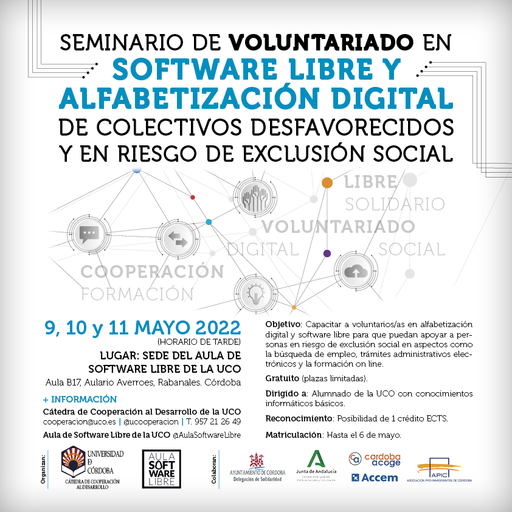

# Inicio

Este taller forma parte de las actividades del [Aula de Software Libre de la
Universidad de Córdoba](https://www.uco.es/aulasoftwarelibre).

El contenido del mismo es en parte de producción propia, en parte de otros
manuales libres que pueden encontrarse en la sección de [Referencias](/referencias).

## Contenido

- [Bienvenido a Linux](Linux/linux.md)
- [Primeros pasos en Writter](Writter/writter.md)
- [Aprende a trabajar con Calc](Calc/calc.md)
- [Presentaciones con Impress](Impress/impress.md)
- [Navegando con Firefox](Firefox/firefox.md)
- [Retoca tus fotos con Gimp](GIMP/gimp.md)
- [Referencias](referencias.md)

## Agradecimientos

Este curso ha sido realizado por las siguientes personas:

- Mayte Hernández
- Teresa González
- Alfonso Padilla
- Emilio Aguilar
- [Marcos Rivera](https://github.com/MarcosRigal)

## Licencia

El material está publicado con licencia [Atribución-NoComercial 4.0 Internacional (CC BY-NC 4.0)](https://creativecommons.org/licenses/by-nc/4.0/deed.es)